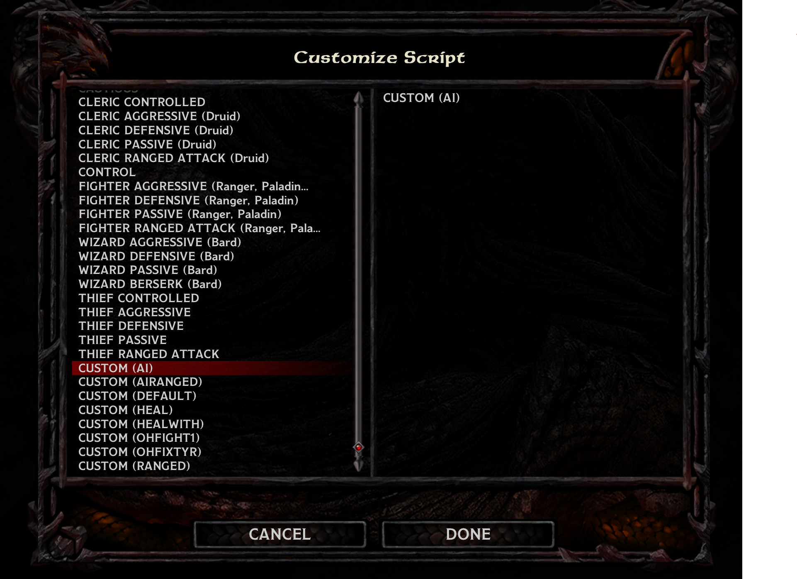

# BaldursGateAI
My own scripts for the AI in Baldurs Gate Enhanced Edition. You can apply them using [Near Infinity](https://baldursgate.fandom.com/wiki/Near_Infinity) which can be downloaded [here](https://github.com/NearInfinityBrowser/NearInfinity/wiki). Extract the zip file and place the folder anywhere, it should be able to find the games by itself. Run the executable jar file by navigating to it in the command prompt and type 'java -jar NearInfinity.jar'. To open the games files in Near Infinity in the menu click *Game* -> *Open Game* and browse for the game directory where the .key file is located.

To add the script files to your game, find the folder *Scripts* within Near Infinity and click on one of the .BS files to select it and then click *File* -> *Add Copy Of...* in the menu at the top. Name the new file ai.BS. Replace the contents of the file and then click *Compile* and then *Save*. To apply the AI script to your character in the game, open the character menu and click *Customize* at the bottom, select *Script* and if you scroll down you should now see an option *Custom (AI)*. Select this and click save. That's it, your character should now follow these actions. 

They should have overhead messages saying what they are doing, you can turn these off by commenting out the lines with *DisplayStringHead(Myself,[number])*. But make sure to click *Compile* and *Save* again.

The file ai.BS is used for all melee fighters

The file aiRanged.BS is used for all ranged characters like wizards and archers.

The only difference between the two is that aiRanged.BS makes the characters move away from enemies whenever enemies come near rather than just at low health

In order of priority of actions the AI takes

1. Healing Spells 

   1. Cleric - Cure Light Wounds - If Health Low
   2. Cleric - Cure Medium Wounds - If Health Low
   3. Cleric - Cure Serious Wounds - If Health Low
2. Healing Potions 

   1. Potion of Healing - If Health Low
   2. Potion of Extra Healing - If Health Low
   3. Antidote - If Poisoned
   4. Elixir of Health - If Diseased Or Poisoned
   
3. Stay At Least 1 Step Apart From Each Other
5. Run Away If Health Is Low  

   1. If enemy within 5 steps, run 10 steps away
   2. If enemy within 10 steps, run 5 steps away
6. Debuff/Control Spells  

   1. Cleric - Silence - If Enemy Spellcasters
   2. Wizard - Horror - If Many Enemies
7. Summon Spells 

   1. Cleric - Animate Undead
8. Buff Spells  

   1. Cleric - Bless - If Enemies Nearby
   2. Cleric - Chant - If Enemies Nearby
   3. Cleric - Protection From Evil
   4. Cleric - Barkskin
   5. Cleric - Aid
   5. Wizard - Chaos Shield
   6. Wizard - Wizard Shield
   6. Wizard - Minor Spell Deflection
   7. Cleric - Shillelagh
   8. Cleric - Flame Blade
   9. Cleric - Draw Upon Holy Might
   10. Cleric - Armor Of Faith
   11. Wizard - Minor Globe Of Invulnerability - If Enemy Spellcasters
   12. Wizard - Resist Fear
9. Offensive Spells 

   1. Wizard - Magic Missile
   2. Wizard - Flame Arrow
   3. Wizard - Agannazar Scorcher
10. Attack Attackers Of Hurt Allies
10. Attack My Attacker  
11. Attack Weakest Nearby Enemies
11. Attack Nearby Enemies  
12. Regroup
13. Thief - Find Traps
14. Randomly Turn Around

 ### Spells That Block Spells
 
 Cannot be dispelled with dispel magic or remove magic. Requires a spell breach type spell to remove them.
 
 Globe Of Invulnerability : Blocks all spells level 4 or lower.  
 Spell Deflection: Absorbs a certain number of spells. (Will break after blocking so many spells.)  
 Spell Turning: Turns the spells back on the original caster. (Will break after blocking so many spells.)  
 Spell Immunity: Blocks all spells from a certain magic school.  
 
 Can be dispelled with dispel magic or remove magic.
 
 Spell Shield: Immune to the spell magic missile.  
 
 The following logic is applied to all spells cast to make sure they are not wasted if the enemy has a spell blocking spell active.
 
 If the spell level is 4 or lower, don't cast it if the enemy has Globe of Invulnerability.  
 If the spell is a debuff spell, don't cast it if the enemy has Spell Deflection.  
 If the spell is an offensive or debuff spell, don't cast it if the enemy has Spell Turning.  
 If the spell is of X magic school, don't cast it if the enemy has Spell Immunity X.  
 If the spell is magic missile, don't cast it if the enemy has Spell Shield.  
 
 If the spell is remove magic or dispel magic, cast it if the enemy has a magical buff (including Shield)  
 If the spell is a spell breach type spell, cast it if the enemy has a spell blocking spell (not including Shield)  

 ### Useful links

Descriptions of all the AI and game actions https://gibberlings3.github.io/iesdp/scripting/actions/bgeeactions.htm

Introduction to scripting AI http://www.pocketplane.net/tutorials/simscript.html

Creature Spawn List https://gamefaqs.gamespot.com/pc/75251-baldurs-gate/faqs/7777

Checking Spell States And Effects https://sorcerers.net/Games/BG2/SpellsReference/SpellEffects.htm
