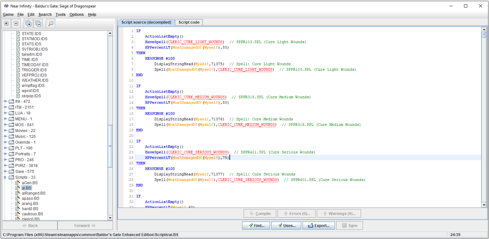

# BaldursGateAI
My own scripts for the AI in Baldurs Gate Enhanced Edition. You can apply them using [Near Infinity](https://baldursgate.fandom.com/wiki/Near_Infinity) which can be downloaded [here](https://github.com/NearInfinityBrowser/NearInfinity/wiki). Extract the zip file and place the folder anywhere, it should be able to find the games by itself. Run the executable jar file by navigating to it in the command prompt and type 'java -jar NearInfinity.jar'. To open the games files in Near Infinity in the menu click *Game* -> *Open Game* and browse for the game directory where the .key file is located.

The file ai.BS is used for all melee fighters
The file aiRanged.BS is used for all ranged characters like wizards and archers.

The only difference between the two is that aiRanged.BS makes the characters move away from enemies whenever enemies come near rather than just at low health

In order of priority of actions the AI takes

1. Healing Spells 

   1. Cleric - Cure Light Wounds - If Health Low
   2. Cleric - Cure Medium Wounds - If Health Low
   3. Cleric - Cure Serious Wounds - If Health Low
2. Healing Potions 

   1. Potion of Healing - If Health Low
   2. Potion of Extra Healing - If Health Low
   3. Antidote - If Poisoned
   4. Elixir of Health - If Diseased Or Poisoned
5. Run Away If Health Is Low  

   1. If enemy within 5 steps, run 10 steps away
   2. If enemy within 10 steps, run 5 steps away
6. Debuff/Control Spells  

   1. Cleric - Silence - If Enemy Spellcasters
   2. Wizard - Horror - If Many Enemies
7. Summon Spells 

   1. Cleric - Animate Undead
8. Buff Spells  

   1. Cleric - Bless - If Enemies Nearby
   2. Cleric - Chant - If Enemies Nearby
   3. Cleric - Protection From Evil
   4. Cleric - Barkskin
   5. Wizard - Chaos Shield
   6. Wizard - Wizard Shield
   7. Cleric - Shillelagh
   8. Cleric - Flame Blade
   9. Cleric - Draw Upon Holy Might
   10. Cleric - Armor Of Faith
   11. Wizard - Minor Globe Of Invulnerability - If Enemy Spellcasters
   12. Wizard - Resist Fear
9. Offensive Spells 

   1. Wizard - Magic Missile
   2. Wizard - Flame Arrow
   3. Wizard - Agannazar Scorcher
10. Attack Attackers Of Hurt Allies
11. Attack Weakest Nearby Enemies
10. Attack My Attacker  
11. Attack Nearby Enemies  
12. Regroup
13. Find Traps
14. Randomly Turn Around

 ### Useful links

Descriptions of all the AI and game actions https://gibberlings3.github.io/iesdp/scripting/actions/bgeeactions.htm

Introduction to scripting AI http://www.pocketplane.net/tutorials/simscript.html

Creature Spawn List https://gamefaqs.gamespot.com/pc/75251-baldurs-gate/faqs/7777
