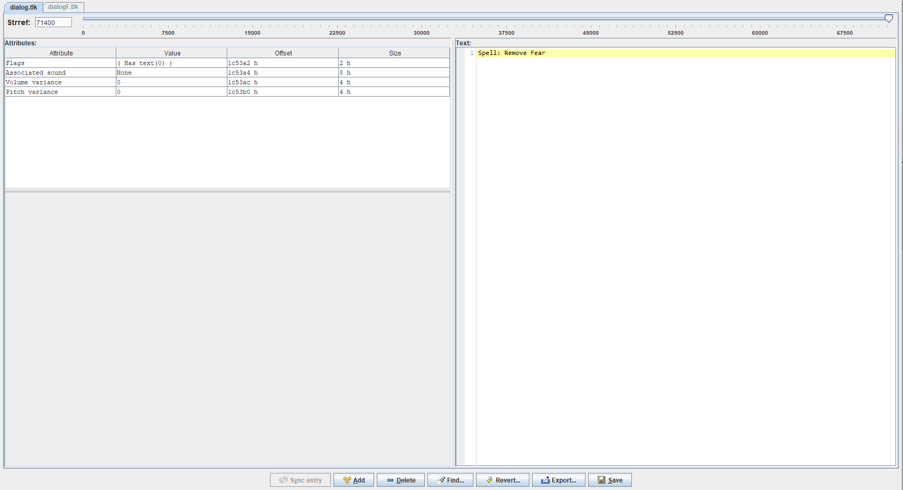

# Party AI Scripts For Baldurs Gate

My own scripts for the AI in Baldurs Gate Enhanced Edition. I was getting annoyed at the party AI casting healing spells too late, as well as some other things, so I started looking into changing the AI and got a bit carried away with it. I used the software Near Infinity to edit the scripts. I'll take you through how you can apply these scripts to your game or even make your own. I'm using the enhanced edition of Baldur's Gate from steam, I can't promise this will work if you don't have all the expansions.

# Install Near Infinity

You can apply them using [Near Infinity](https://baldursgate.fandom.com/wiki/Near_Infinity) which can be downloaded [here](https://github.com/NearInfinityBrowser/NearInfinity/wiki). Extract the zip file and place the folder anywhere, it should be able to find the games by itself. Run the executable jar file by navigating to it in the command prompt and type 'java -jar NearInfinity.jar'. To open the games files in Near Infinity in the menu click *Game* -> *Open Game* and browse for the game directory where the .key file is located. I'm using the steam version of Baldurs Gate, C:\Program Files (x86)\Steam\steamapps\common\Baldur's Gate Enhanced Edition, but this should work with any version of the game.

# Run Modmerge

I've also added messages that appear above the party members heads that tell you what their next action is. e.g. 'Attacking Nearest Enemy'. To do this I've had to add new text strings to the game by editing the dialog.tlk file which is a list of all the different text in the game. This is mostly for debugging to make sure they are doing the right thing and can be useful for when you want to write your own scripts. If you don't want these messages to appear, then you can just use find and replace to comment out or remove all the lines with *DisplayStringHead(Myself,[number])* and skip this step.

To get these messages to appear you will need to download Modmerge from [here](https://github.com/ScottBrooks/modmerge/releases) and place the modmerge.exe into your root Baldur's Gate Folder, the folder with the Baldur.exe. Then run modmerge.exe and this will allow the dialog.tlk file to become editable and for NearInfinity to recognize changes to the dialog.tlk. You can then replace the dialog.tlk file in the lang\en_US folder with the one included in this repo. To make sure its working, you can load up NearInfinity and go to *Edit* -> *String table* to see the dialog.tlk file. There should be more than 71374 different text strings now.

Avoid updating the game through steam or backing it up through steam as it will change some of the files as it verifies the files. This may cause the new strings in the dialog.tlk to not be recognized again and you will end up with messages like 'Invalid: 71400'. To fix this you will have to run modmerge again. However, modmerge will think it doesn't need to be run as some of the files it creates, have already been created. To make modmerge run again you will have to delete some files as mentioned here. https://forums.beamdog.com/discussion/comment/1005105/#Comment_1005105. Delete the files sod-dlc.disabled, sod-dlc.key, chitin.key.bak and the folder sod-dlc. Then try running modmerge again. Otherwise it should work again if you reinstall and follow these steps again.

# Add The New AI Scripts

To add the script files to your game, find the folder *Scripts* within Near Infinity and click on one of the .BS files to select it and then click *File* -> *Add Copy Of...* in the menu at the top. Name the new file ai.BS. Replace the contents of the file with the ai.BS in this repo and then click *Compile* and then *Save*. To apply the AI script to your character in the game, open the character menu and click *Customize* at the bottom, select *Script* and if you scroll down you should now see an option *Custom (AI)*. Select this and click save. That's it, your character should now follow these actions. 

# The AI Actions

The file ai.BS is used for all melee fighters and the file aiRanged.BS is used for all ranged characters like wizards and archers. The only difference between the two is that aiRanged.BS makes the characters move away from enemies whenever enemies come near rather than just at low health to keep them at a distance.

In order of priority of actions the AI takes

1. Healing Spells 

   1. Cleric - Cure Light Wounds - If Health Low
   2. Cleric - Cure Medium Wounds - If Health Low
   3. Cleric - Cure Serious Wounds - If Health Low
2. Healing Potions 

   1. Potion of Healing - If Health Low
   2. Potion of Extra Healing - If Health Low
   3. Antidote - If Poisoned
   4. Elixir of Health - If Health Low, Poisoned or Diseased
   
5. Run Away If Health Is Low  

   1. If enemy nearby and space to run away, run away
   2. If enemy nearby and no space to run away, continue with normal actions and attack
6. Debuff/Control Spells  

   1. Cleric - Silence - If Enemy Spellcasters
   2. Wizard - Secret Word - If Spellcaster with Spell Blocking Spell
   2. Wizard - Hold Monster - If Many Enemies
   2. Wizard - Chaos - If Many Enemies
   2. Wizard - Horror - If Many Enemies
   3. Wizard - Remove Magic - If Enemy With Magical Buff
   4. Cleric - Dispel Magic - If Ally With Magical Debuff
   4. Cleric - Dispel Magic - If Enemy With Magical Buff
   5. Cleric - Miscast Magic - If Enemy Spellcasters
6. Cleric - Turn Undead

7. Summon Spells 

   1. Cleric - Animate Undead
   2. Cleric - Call Woodland Beings
   3. Cleric - Animal Summoning 3
   4. Cleric - Animal Summoning 2
   5. Cleric - Animal Summoning 1
8. Buff Spells  

   1. Cleric - Bless
   2. Cleric - Chant
   2. Cleric - Defensive Harmony
   2. Cleric - Remove Fear
   3. Cleric - Protection From Evil
   3. Cleric - Protection From Evil 10 Foot
   4. Cleric - Barkskin
   5. Cleric - Aid
   5. Wizard - Chaos Shield
   6. Wizard - Shield
   7. Cleric - Shillelagh
   8. Cleric - Flame Blade
   9. Cleric - Draw Upon Holy Might
   10. Cleric - Armor Of Faith
   11. Cleric - Holy Power
   12. Wizard - Resist Fear
   13. Wizard - Haste
   14. Wizard - Mirror Image
   15. Wizard - Minor Globe Of Invulnerability
   15. Wizard - Minor Spell Deflection
   16. Wizard - Improved Invisibility
   
9. Offensive Spells 

   1. Wizard - Magic Missile
   2. Wizard - Flame Arrow
   2. Wizard - Melf Acid Arrow
   3. Wizard - Agannazar Scorcher
   4. Cleric - Holy Smite
9. Use Wands

   1. Wand Of Fear - If Many Enemies
   2. Wand Of Magic Missile
   2. Wand Of Frost
10. Attack Attackers Of Hurt Allies
10. Attack My Attacker  
11. Attack Weakest Nearby Enemies
11. Attack Nearby Enemies  
12. Regroup
13. Thief - Find Traps

 ### Spells That Block Spells
 
 Cannot be dispelled with dispel magic or remove magic. Requires a spell breach type spell to remove them.
 
 Globe Of Invulnerability : Blocks all spells of a certain level or lower. (Will NOT break after a certain number of spells)  
 Spell Deflection: Absorbs a certain number of spells. (Will break after a certain number of spells)  
 Spell Turning: Turns a certain number of spells back towards the original caster. (Will break after a certain number of spells)   
 Spell Immunity: Blocks all spells from a certain magic school. (Will NOT break after a certain number of spells)  
 
 Can be dispelled with dispel magic or remove magic.  
 
 Shield: Immune to the spell magic missile. (Will NOT break after a certain number of spells)  
 
 The following logic is applied to all spells cast to make sure they are not wasted if the enemy has a spell blocking spell active.  
 
 If the spell level is 3 or lower, cast it if the enemy doesn't have a Globe of Invulnerability. Theres no separate check to determine whether they have minor globe or normal globe active so assume you cant cast level 3 or lower spells for now. This will mean sometimes level 4 spells will still be wasted if the enemy does have globe of invulnerability.
 
 !CheckStat(LastSeenBy(Myself),1,MINORGLOBE)
 
 If the spell is a debuff spell, cast it if the enemy doesn't have Spell Deflection. Theres no separate check to determine whether they have minor spell deflection or normal spell deflection.
 
 !CheckStat(LastSeenBy(Myself),1,WIZARD_SPELL_DEFLECTION)
 
 If the spell is an offensive or debuff spell, cast it if the enemy doesn't have Spell Turning. Theres no separate check to determine whether they have minor spell turning or normal spell turning.
 
 !CheckStat(LastSeenBy(Myself),1,WIZARD_SPELL_TURNING)
 
 If the spell is of X magic school, cast it if the enemy doesn't have Spell Immunity to magic school X.
 
 !CheckStat(LastSeenBy(Myself),X,WIZARD_SPELL_IMMUNITY)  
 
 If the spell is magic missile, cast it if the enemy doesn't have Shield.  
 
 !CheckSpellState(LastSeenBy(Myself),WIZARD_SHIELD)  
 
 If the spell is remove magic or dispel magic, cast it if the enemy has a magical buff (including Shield)  
 If the spell is a spell breach type spell, cast it if the enemy has a spell blocking spell (not including Shield)  

 Spell Schools  
 1 = Abjuration   
 2 = Conjuration   
 3 = Divination  
 4 = Enchantment   
 5 = Illusion  
 6 = Evocation  
 7 = Necromancy  
 8 = Alteration   

For each spell, we also check that the enemy isn't immune to spells of that spell level  

!ImmuneToSpellLevel(LastSeenBy(Myself),8)

We also check for Magic, Fire, Cold, Electricity and Acid Resistance

CheckStatLT(LastSeenBy(Myself),75,RESISTMAGIC)  
CheckStatLT(LastSeenBy(Myself),75,RESISTFIRE)  
CheckStatLT(LastSeenBy(Myself),75,RESISTCOLD)  
CheckStatLT(LastSeenBy(Myself),75,RESISTELECTRICITY)  
CheckStatLT(LastSeenBy(Myself),75,RESISTACID)  

We also check nothing is stopping us from casting spells

!CheckStatGT(Myself,0,CLERIC_INSECT_PLAGUE)  
!StateCheck(Myself,STATE_SILENCED)  
CheckStatLT(Myself,50,SPELLFAILUREMAGE)  

 ### Testing Creatures
 
 CLUAConsole:CreateCreature("skelet") Skeleton   
 CLUAConsole:CreateCreature("werewogr") Greater Werewolf

 ### Useful links

Descriptions of all the AI and game actions https://gibberlings3.github.io/iesdp/scripting/actions/bgeeactions.htm

Introduction to scripting AI http://www.pocketplane.net/tutorials/simscript.html

Creature Spawn List https://gamefaqs.gamespot.com/pc/75251-baldurs-gate/faqs/7777

Checking Spell States And Effects https://sorcerers.net/Games/BG2/SpellsReference/SpellEffects.htm

How Scripts Work http://www.pocketplane.net/tutorials/simscript.html#EssVariables
